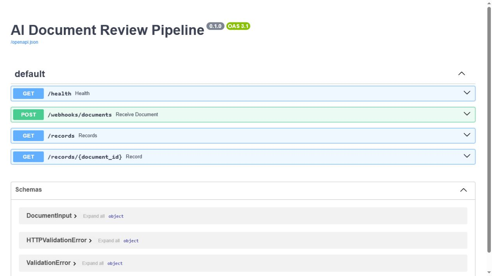

# AI Document Review Pipeline

Честный демонстрационный проект для портфолио: входящий документ проходит через классификацию, бизнес-правила и сохраняется в SQLite. Надёжные случаи получают статус `ready`; спорные попадают в очередь `review`. Каждое решение сопровождается журналом причин.

> Это локальный demo-проект на синтетических данных. Он не подключён к банкам, 1С, Telegram или LLM-провайдерам и не заявляет измеримый коммерческий эффект.

## Что показывает проект

- HTTP webhook для приёма документов;
- явное разделение классификации и бизнес-правил;
- защита от «слепого» AI-решения: низкая уверенность, неизвестный контрагент и невалидная сумма отправляются на ручную проверку;
- SQLite-очередь и неизменяемый audit trail;
- готовая схема для n8n: webhook → API → уведомление о новых исключениях;
- unit-тесты на основные ветки решения.

## Схема

```text
Документ / webhook
        │
        ▼
Классификатор (demo adapter)
        │
        ▼
Правила валидации ──► review queue ──► оператор
        │
        ▼
      ready
        │
        ▼
SQLite + audit log
```

## API preview

Swagger/OpenAPI интерфейс, сгенерированный при локальном запуске demo-проекта:



## Быстрый запуск

```powershell
cd ai-document-review-pipeline
py -m venv .venv
.\.venv\Scripts\Activate.ps1
pip install -r requirements.txt
uvicorn app.main:app --reload
```

После запуска откройте `http://127.0.0.1:8000/docs`.

Пример запроса:

```powershell
Invoke-RestMethod -Method Post -Uri http://127.0.0.1:8000/webhooks/documents `
  -ContentType 'application/json' `
  -Body '{"source":"demo","text":"Оплата счёта ООО Ромашка 12500 RUB"}'
```

Проверить очередь исключений:

```powershell
Invoke-RestMethod http://127.0.0.1:8000/records?status=review
```

## Тесты

```powershell
py -m unittest discover -s tests -v
```

## n8n

Файл [workflows/document-review-webhook.json](workflows/document-review-webhook.json) можно импортировать в n8n. Он иллюстрирует передачу документа в API и развилку `ready/review`; URL и учётные данные намеренно не встроены.

## Reversal Radar (отдельный модуль)

В репозитории лежит второй самостоятельный инструмент — `reversal_radar/`: радар разворота по перп-контракту (по умолчанию HYPE на Hyperliquid). Он собирает свечи, funding, open interest и стакан, считает сигналы (реакция на уровень, объём, RSI-дивергенция, согласие таймфреймов) и выдаёт счёт от −100 до +100 вместе с планом на оба исхода и точками инвалидации.

```powershell
python -m reversal_radar --coin HYPE --level 83.40 report   # разовый отчёт
python -m reversal_radar --coin HYPE watch --interval 180    # наблюдение с алертами
python -m reversal_radar --coin HYPE bot                     # телеграм-бот
python -m reversal_radar --coin HYPE serve --port 8100       # веб-виджет
python -m reversal_radar --demo exhaustion --level 83.40 report  # демо без сети
```

Подробности, список сигналов, переменные окружения и Docker: [docs/reversal-radar.md](docs/reversal-radar.md).

> Радар не предсказывает цену и не даёт торговых рекомендаций: он показывает, какой сценарий подтверждён наблюдаемыми данными, а какой — нет.

## Как развивать проект

1. Заменить `DemoClassifier` на адаптер конкретного LLM с таймаутами и логированием версии модели.
2. Добавить аутентификацию webhook и шифрование секретов через переменные окружения.
3. Подключить PostgreSQL, повторные попытки и метрики очереди.
4. Перед реальным использованием согласовать правила с владельцем процесса и измерить baseline на обезличенных данных.
